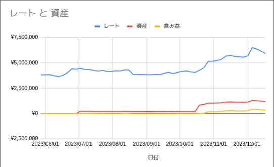

# btchistory


## Usage

Make input.csv from your BTC input history like below
```
2023/05/20 11:05:02,0.01
2023/07/01 04:07:54,0.05
2023/10/14 23:52:47,0.15
```

```
$ btchistory -input input.csv -span 10
日時	レート	資産	含み益
2023-05-28	3771177.000000	0.000000	0.000000
2023-06-01	3793007.000000	0.000000	0.000000
2023-06-05	3806000.000000	0.000000	0.000000
2023-06-09	3686271.000000	0.000000	0.000000
2023-06-13	3618187.000000	0.000000	0.000000
2023-06-17	3730706.000000	0.000000	0.000000
2023-06-21	3989686.000000	0.000000	0.000000
2023-06-25	4384947.000000	0.000000	0.000000
2023-06-29	4348324.000000	0.000000	0.000000
2023-07-03	4423958.000000	221197.900000	0.000000
2023-07-07	4323077.000000	216153.850000	-5044.050000
2023-07-11	4318020.000000	215901.000000	-5296.900000
2023-07-15	4213300.000000	210665.000000	-10532.900000
2023-07-19	4149704.000000	207485.200000	-13712.700000
2023-07-23	4230786.000000	211539.300000	-9658.600000
2023-07-27	4130333.000000	206516.650000	-14681.250000
2023-07-31	4130511.000000	206525.550000	-14672.350000
2023-08-04	4172458.000000	208622.900000	-12575.000000
2023-08-08	4163000.000000	208150.000000	-13047.900000
2023-08-12	4265787.000000	213289.350000	-7908.550000
2023-08-16	4261974.000000	213098.700000	-8099.200000
2023-08-20	3813822.000000	190691.100000	-30506.800000
2023-08-24	3826754.000000	191337.700000	-29860.200000
2023-08-28	3827795.000000	191389.750000	-29808.150000
2023-09-01	3794295.000000	189714.750000	-31483.150000
2023-09-05	3792742.000000	189637.100000	-31560.800000
2023-09-09	3839511.000000	191975.550000	-29222.350000
2023-09-13	3808652.000000	190432.600000	-30765.300000
2023-09-17	3935829.000000	196791.450000	-24406.450000
2023-09-21	4026009.000000	201300.450000	-19897.450000
2023-09-25	3906417.000000	195320.850000	-25877.050000
```



## Installation

```
go install github.com/mattn/btchistory@latest
```

## License

MIT

## Author

Yasuhiro Matsumoto (a.k.a. mattn)
